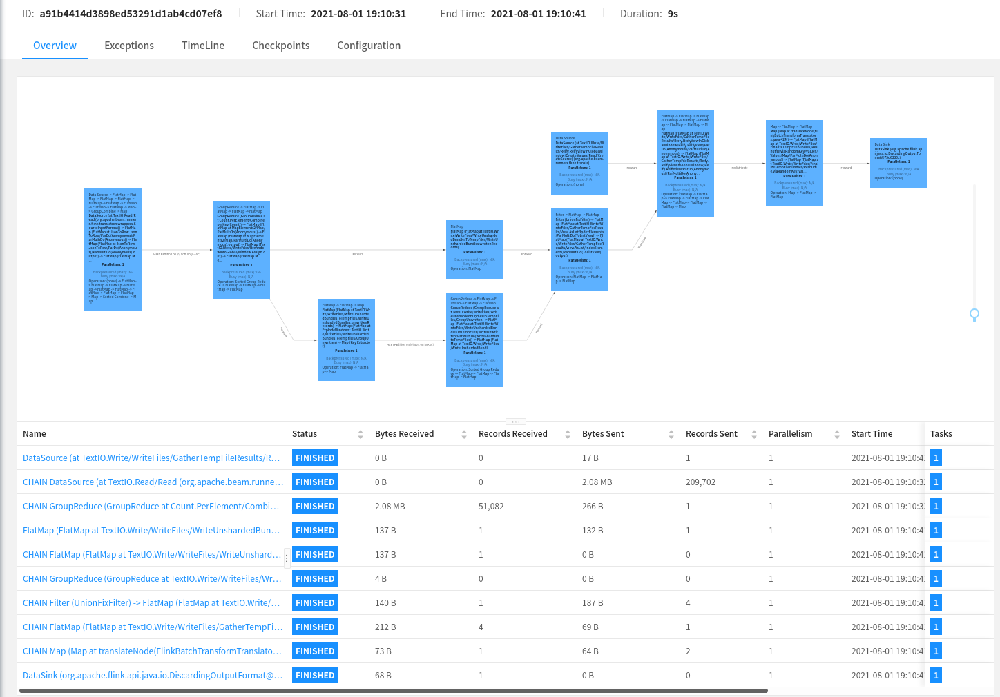

# aws-github-beam-analytics

This is a workspace I am using to learn how to use [Apache Beam](https://beam.apache.org) and some of the related tools such as [Apache Flink](https://flink.apache.org/).

The primary goal of this is to understand how to perform aggregation, partitioning and analysis on large data sets such as the [GitHub Archive](https://www.gharchive.org/).

# Building

To run the tests.

```
mvn test
```

To package up the software for upload to Flink.

```
mvn clean package -Pflink-runner
```

# Example Execution



